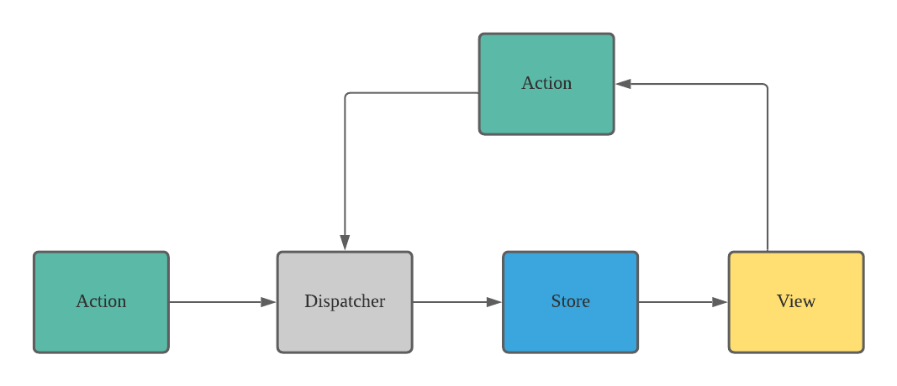

# Assignment 10 (Advanced Training)

## What is FLUX?

It's a pattern (architecure) for managing state in our application. It has four major components:

- **Dispatcher** - is central hub of Flux which receives actions and dispatches them to the store.
- **Store** - It is where the state of the application is stored. It receives actions from dispatcher and updates its states.
- **Views** (React Componeents) - These are React Components, they are responsible for rendering the UI based on the data provided by the store.
- **Actions** - These are user events or any event that can trigger the dispatcher to update the store.

This pattern allows us to manage our application's state in a predictable and one way directional data flow.

## What is Redux? How do you use it with React components?

It's a JavaScript library for predictable and maintainable global state management, primarily used with React. It helps to manage the application's state in a centralized way. It has three core principles:

1. A single source of truth.
2. State is read-only.
3. Changes are made with reducers (pure functions).

## What is a reducer?

Reducer is a pure function that takes in an initial state and an action, and return a new state. A reducer commonly used to manage state in Redux. However you can use reducers without Redux in your React application.

## How do you choose between ContextAPI and Redux for global state management?

If the project is big and complex we can use Redux that centralizes the state management. It's also good if the project is scalable and it can be used with any front-end framework.

In the other hand ContextAPI can be used for smaller and simpler applications. It's simpler and shorter code for sharing data within the application.

## What is redux thunk and why do you want to use it?

Redux thunk is a middleware that allows you to write action creators that return a function instead of an action object. In a typical Redux aplication, action creators return plain objects. This works well for synchronous operations, but it doesn't work for async tasks. Redux thunk can solve this by allowing action creators to return functions that can perform async operations.
